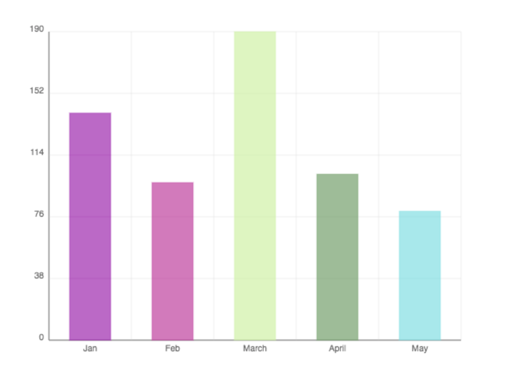

# barChart-js
A simple open source, lightweight bar chart library in Javascript 

[]()
[]()

## Description
bar.js is a configurable, lightweight and dependency-free library providing simple and fast Bar Chart creation experience.
It was built in Javascript with canvas.

<p align="center">
  
</p>

## Installation
Download the `bar.min.js` and include it in your project

```html
<script src="bar.min.js"></script>
```

## Usage
To create the bar chart, you need a block level container like a div

```html
<div id="chart">This will be bar chart!</div>
```
Then you can create the BarChart object in your Javascript file

```js
var barChart = new BarChart(chartId, chartWidth, chartHeight, data);
```

### Parameters
- `chartId - containerId (String)`
Defines the id of container like 'chart'

- `chartWidth (Integer)`
Defines the width of the chart like 500

- `chartHeight (Integer)`
Defines the height of the chart like 400

- `data (Objects Array)`
Defines the data objects. The objects should have 2 key-values pairs: label and value. Example data:

```js
  var data = [
    { label: "Jan", value: 33 },
    { label: "Feb", value: 112 },
    { label: "March", value: 45 },
    { label: "April", value: 237 },
    { label: "May", value: 156 }
  ];
```

## License
[MIT](LICENSE.md) © [Yi Chen](https://github.com/ycbrian)
